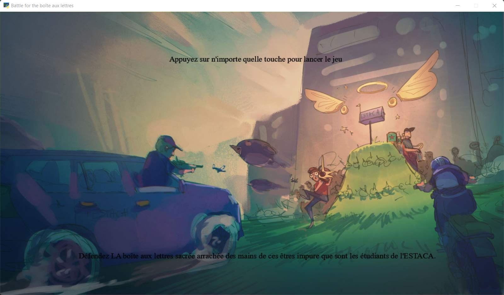
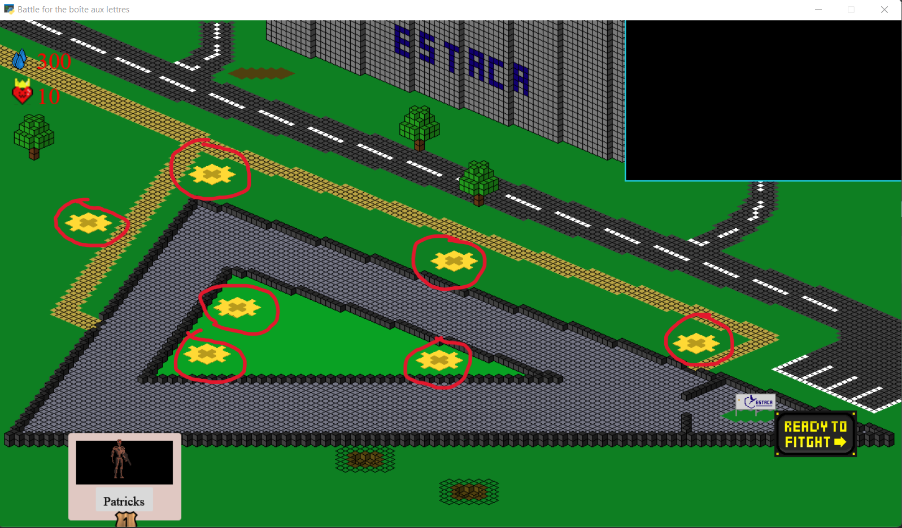
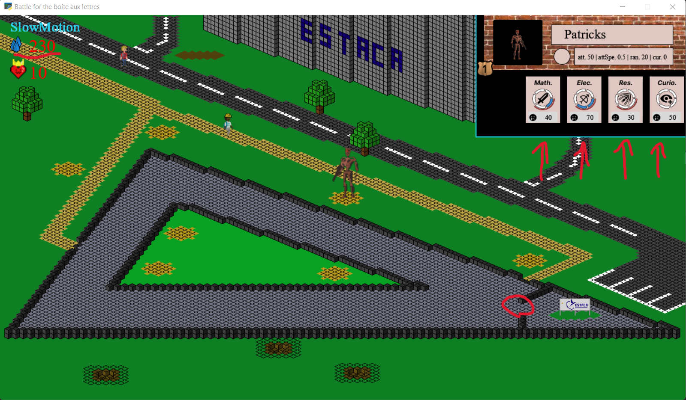
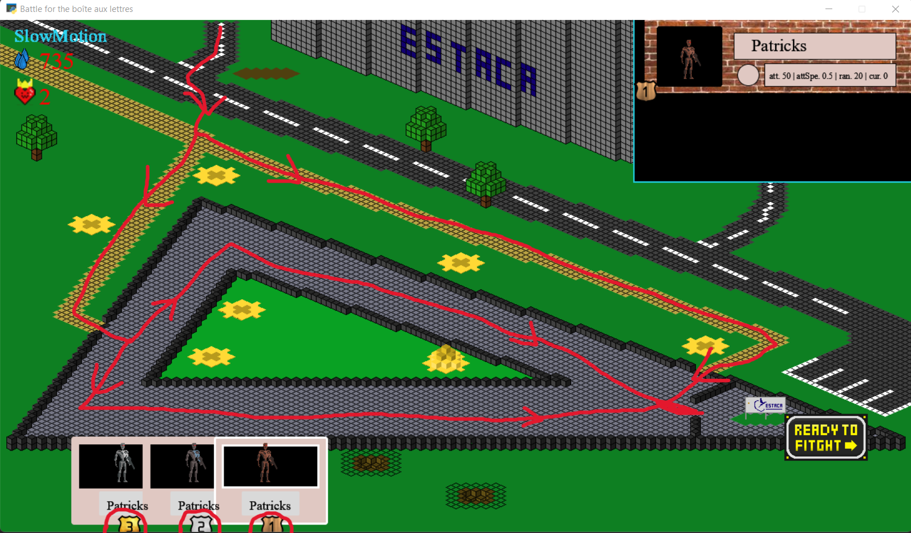
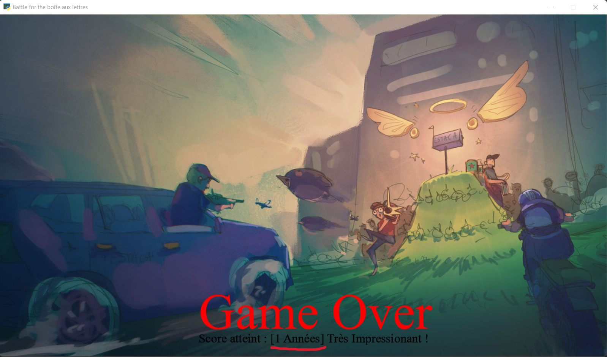

# Comment jouer à Battle for the boîte aux lettres ?

Le jeu se découpe en 
 phases : 
- Le positionement des élèves
- La résolution de la vague

## Positionement des élèves

Cliquez sur l'une des 7 zones disponibles pour y placer l'élève le plus à gauche de votre liste d'élèves.
Cliquez ensuite sur le bouton "READY TO FIGHT"

## Résolution de la vague
En fonction du nombre de vagues que vous avez déjà vaincu, un groupe plus ou moins nombreux d'étudiants de l'ESTACA vont spawn.
Lorsque vous battez un étudiant de l'ESTACA, vous obtenez des lamres d'ESTACA que vous pouver dépenser pour améliorer les étudiants de l'ESIEA.
Les maths correspondent aux dégâts d'attaques, l'électricité à la vitesse d'attaque, le réseau à la portée d'attaque, et la curiosité n'augmente aucune statistique.
De plus, si les membres de l'ESTACA atteigne la zone où est gardée leur boîte aux lettres, vous perdez 1 PV.

### Chemins possibles
Les mobs peuvent empreinter 3 chemins différents pour atteindre la boîte aux lettres. Les voici.

### Score
Enfin, lorsque que l'ESTACA vous submerge par son nombre et vous reprend ce que vous leur avez volé, vous pouvez voir le score que vous avez atteint, qui correspond au nombres d'année que vous avez résister.

